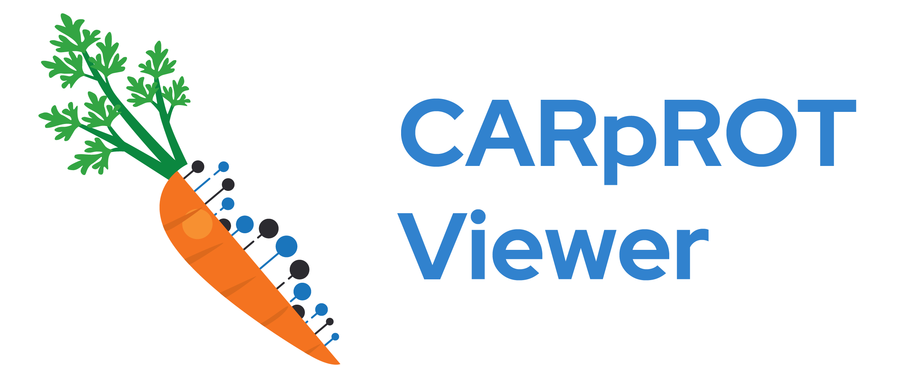

<div style="display: inline-flex; align-items: center">
  
  
</div>

# CARpROT Viewer

CARpROT is an application written for the [Motorola Science Cup 2023](https://science-cup.pl/) competition.

## Features

- Translates DNA and RNA to amino acids
- Finds proteins based on peptide chains
- Calculates properties of peptides:
  - Length
  - Chemical formula
  - Mass
  - Isoelectric Point
  - Charge
  - Extinction Coefficient
  - Hydrophobicity
- Displays protein features using [RCSB Saguaro](https://github.com/rcsb/rcsb-saguaro)
- Displays 3D structure of proteins found in [RCSB PDB](https://www.rcsb.org/)
- Displays 2D skeletal structure of peptides requested form [PepDraw](https://www2.tulane.edu/~biochem/WW/PepDraw/)

## Technologies:

- React
- Typescript
- Electron

## Libraries and APIs used:

- [RCSB Search](https://search.rcsb.org/#search-api) for protein identification
- [RCSB Saguaro](https://github.com/rcsb/rcsb-saguaro) for displaying charts of protein features
- [PepDraw](https://www2.tulane.edu/~biochem/WW/PepDraw/) for getting 2D images

## Installation

- Download latest release file (.exe) [here](https://github.com/MSC-Dolor-Sit-Amet/app/releases/latest)
- Run downloaded app

## Development environment

##### [Node.js](https://nodejs.org/en/) is required to run the app

1. install dependencies

```bash
npm install
```

or

```bash
yarn install
```

2. run app

```bash
npm run dev
```

or

```bash
yarn dev
```

## Usage

1. Click on the input button to open input drawer
2. Enter DNA/RNA sequence or import it from a file (drag it into input area, or use import button below it)
3. Click save
4. Choose a peptide from the list (you can filter out all non-protein peptides by using toggle switches)
5. If a selected peptide is a protein found in **RCSB PDB** a features chart and a 3D model will be displayed, otherwise only peptide properties and a 2D image will be displayed

## How it works

1. DNA is translated to amino acids
2. From sequence of amino acids program selects substrings that start with 'M' (start) and end with '-' (end)
3. All found peptides are cross-checked with the **RCSB PDB** database for a matching protein
4. All peptides are displayed with option of filtering proteins found in the **RCSB PDB**
5. When a peptide is selected:
   1. Its properties are calculated
   2. An image from PepDraw is requested
   3. If the selected peptide is a protein:
      - A chart of its features is displayed
      - A 3D structure model is requested from **RCSB PDB** and displayed

## Credits

Parts of logo designed by [pch.vector](https://www.freepik.com/author/pch-vector) and [Bakar015](https://www.freepik.com/author/bakar015) / Freepik
