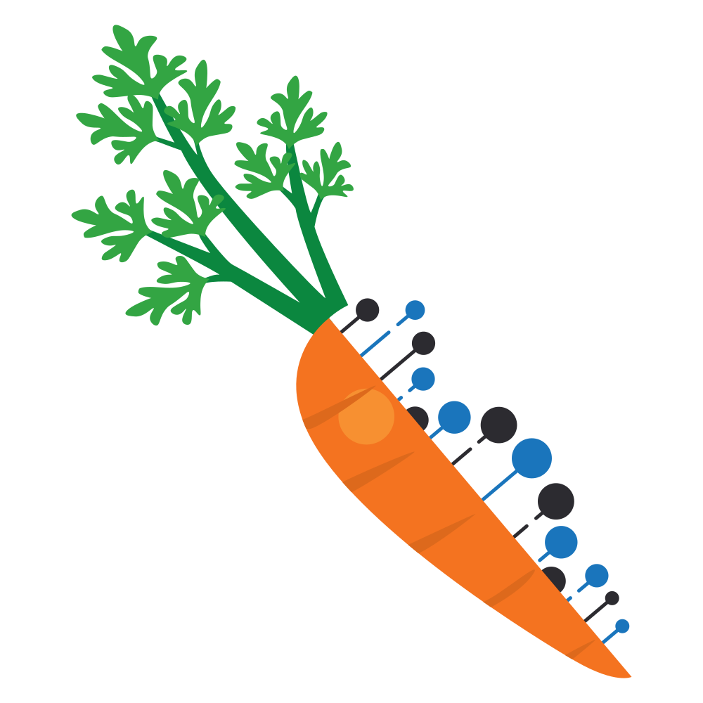

# CARpROT Viewer

CARpROT is an application written for the [Motorola Science Cup 2023](https://science-cup.pl/) competition.

## Fetures

- Translates DNA and RNA to amino acids
- Finds proteins based on peptide chains
- Calculates properties of proteins:
  - Length
  - Chemical formula
  - Mass
  - Isoelectric Point
  - Charge
  - Extinction Coefficient
  - Hydrophobicity
- Displays protein features using [RCSB Saguaro](https://github.com/rcsb/rcsb-saguaro)
- Displays 3D structure of proteins found in [RCSB PDB](https://www.rcsb.org/)
- Displays 2D skeletal structure of peptides fetched form [PepDraw](https://www2.tulane.edu/~biochem/WW/PepDraw/)

## Technologies:

- React
- Typescript
- Electron

## Libraries and APIs used:

- [RCSB Search](https://search.rcsb.org/#search-api) for protein identification
- [RCSB Saguaro](https://github.com/rcsb/rcsb-saguaro) for displaying charts of protein features
- [PepDraw](https://www2.tulane.edu/~biochem/WW/PepDraw/) for getting 2D images

## Installation

TODO

## Usage

TODO

## How it works

1. DNA is translated to amino acids
2. From sequence of amino acids we select substrings that start with 'M' (start) and end with '-' (end)
3. All found peptides are cross-checked with **RCSB PDB** database for a matching protein
4. All peptides are displayed with option of filtering proteins found in **RCSB PDB**
5. When a peptide is selected:
   1. Its properties are calculated
   2. An image from PepDraw is requested
   3. If the selected peptide is a protein:
      - A chart of its features is displayed
      - A 3D structure model is requested from **RCSB PDB** and displayed
